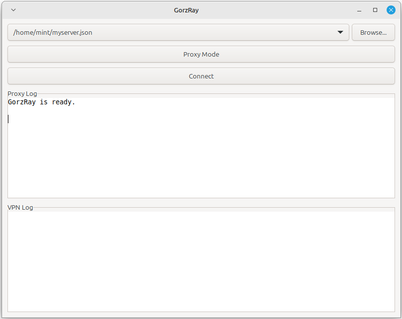

# GorzRay

A user-friendly Xray GUI client with a focus on simplicity and enhancing VPN experience.

## Features
- Simple, intuitive GUI with support for Xray configs and json sublinks
- Minimal setup required--select the Xray config or the text file containing your sublink and connect
- Easy toggle between Proxy and VPN modes
- Privacy-focused by having zero DNS-leak VPN mode through preprocessing config files and using tun2proxy
- Secure user permission handling via Polkit; optional passwordless VPN mode connection
- Linux desktop integration with tray, startup options and Unix socket connection
- All-in-one Python code; suitable for portability


## How to Build

The code is portable and you can directly run it by installing `requests`, `psutil`, `PyGObject` and `pystray` modules via `pip` or your distribution's package manager for Python. In that case, some modifications of the source code are required as currently it is set for use in an [AppImage](https://github.com/AppImage/AppImageKit).

If you want to make an appimage, create a directory named `AppDir` with the following layout:

```bash
AppDir/
|-- AppRun
|-- GorzRay.desktop
|-- gorzray-icon-proxy.png
|-- gorzray-icon-vpn.png
|-- gorzray-icon.png
`-- usr
    |-- bin
    |   |-- gorzray.py
    |   |-- tun2proxy-bin
    |   `-- xray-bin
    `-- share
        |-- metainfo
        |   `-- GorzRay.appdata.xml
        `-- xray-geofiles
            |-- geoip.dat
            `-- geosite.dat

5 directories, 11 files
```

You can find the other needed files in the [assets](assets) directory of this repository. Download the binaries from [Xray-core](https://github.com/XTLS/Xray-core) and [tun2proxy](https://github.com/tun2proxy/tun2proxy). Geo assets can be obtained from [Xray-core](https://github.com/XTLS/Xray-core) or [Iran-v2ray-rules](https://github.com/Chocolate4U/Iran-v2ray-rules), or any other reliable source.

Then include your version of choice for [a portable] Python. For example, using [linuxdeploy](https://github.com/linuxdeploy/linuxdeploy), download the tools and run:

```bash
PIP_REQUIREMENTS="requests psutil PyGObject pystray" ./linuxdeploy-plugin-python.sh --appdir AppDir/
```
And:

```bash
DEPLOY_GTK_VERSION=3 ./linuxdeploy-x86_64.AppImage --appdir AppDir --output appimage --icon-file AppDir/gorzray-icon.png --desktop-file AppDir/GorzRay.desktop --plugin gtk
```
Which will build the AppImage.

## License
This project is licensed under the GNU AGPL v3.0. See [LICENSE](LICENSE) for details.

## Attribution

This project includes binaries/assets from software developed by:
- [Xray-core](https://github.com/XTLS/Xray-core) (GPL-3.0)
- [tun2proxy](https://github.com/tun2proxy/tun2proxy) (MIT License)

See [LICENCES](LICENSES) for full license texts.
Icons were generated with OpenAI's ChatGPT (DALL-E) and modified in GIMP. No attribution is required.
